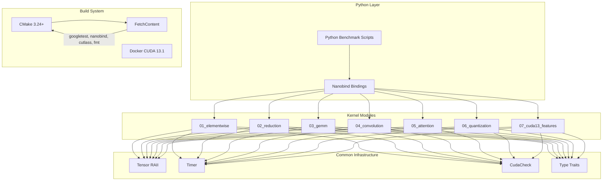

# Design Document: HPC-AI-Optimization-Lab

## Overview

HPC-AI-Optimization-Lab 是一个模块化的高性能 CUDA 算子优化教学项目。项目采用分层架构，从底层通用工具库到上层特定算子实现，每个模块独立可测试。核心设计理念是"渐进式优化"——每个算子都提供从 Naive 到极致优化的多个版本，便于学习者理解优化原理。

## Architecture



## Components and Interfaces

### 1. Common Library (`src/common/`)

#### 1.1 CudaCheck (`cuda_check.cuh`)
```cpp
#pragma once
#include <cuda_runtime.h>
#include <cstdio>
#include <cstdlib>

#define CUDA_CHECK(call)                                                    \
    do {                                                                    \
        cudaError_t err = call;                                             \
        if (err != cudaSuccess) {                                           \
            fprintf(stderr, "CUDA error at %s:%d: %s\n",                    \
                    __FILE__, __LINE__, cudaGetErrorString(err));           \
            exit(EXIT_FAILURE);                                             \
        }                                                                   \
    } while (0)

#define CUDA_CHECK_LAST() CUDA_CHECK(cudaGetLastError())
```

#### 1.2 Timer (`timer.cuh`)
```cpp
#pragma once
#include <cuda_runtime.h>
#include "cuda_check.cuh"

namespace hpc {

class CudaTimer {
public:
    CudaTimer() {
        CUDA_CHECK(cudaEventCreate(&start_));
        CUDA_CHECK(cudaEventCreate(&stop_));
    }
    
    ~CudaTimer() {
        cudaEventDestroy(start_);
        cudaEventDestroy(stop_);
    }
    
    void start(cudaStream_t stream = nullptr) {
        CUDA_CHECK(cudaEventRecord(start_, stream));
    }
    
    void stop(cudaStream_t stream = nullptr) {
        CUDA_CHECK(cudaEventRecord(stop_, stream));
        CUDA_CHECK(cudaEventSynchronize(stop_));
    }
    
    [[nodiscard]] float elapsed_ms() const {
        float ms = 0.0f;
        CUDA_CHECK(cudaEventElapsedTime(&ms, start_, stop_));
        return ms;
    }

private:
    cudaEvent_t start_, stop_;
};

} // namespace hpc
```

#### 1.3 Tensor RAII (`tensor.cuh`)
```cpp
#pragma once
#include <cuda_runtime.h>
#include <vector>
#include <concepts>
#include "cuda_check.cuh"

namespace hpc {

template<typename T>
concept CudaNumeric = std::is_arithmetic_v<T> || 
                      std::is_same_v<T, __half> || 
                      std::is_same_v<T, __nv_bfloat16>;

template<CudaNumeric T>
class Tensor {
public:
    explicit Tensor(size_t size) : size_(size), data_(nullptr) {
        CUDA_CHECK(cudaMalloc(&data_, size * sizeof(T)));
    }
    
    ~Tensor() {
        if (data_) cudaFree(data_);
    }
    
    // Move semantics
    Tensor(Tensor&& other) noexcept : size_(other.size_), data_(other.data_) {
        other.data_ = nullptr;
        other.size_ = 0;
    }
    
    Tensor& operator=(Tensor&& other) noexcept {
        if (this != &other) {
            if (data_) cudaFree(data_);
            data_ = other.data_;
            size_ = other.size_;
            other.data_ = nullptr;
            other.size_ = 0;
        }
        return *this;
    }
    
    // Delete copy
    Tensor(const Tensor&) = delete;
    Tensor& operator=(const Tensor&) = delete;
    
    [[nodiscard]] T* data() noexcept { return data_; }
    [[nodiscard]] const T* data() const noexcept { return data_; }
    [[nodiscard]] size_t size() const noexcept { return size_; }
    [[nodiscard]] size_t bytes() const noexcept { return size_ * sizeof(T); }
    
    void copy_from_host(const T* host_data) {
        CUDA_CHECK(cudaMemcpy(data_, host_data, bytes(), cudaMemcpyHostToDevice));
    }
    
    void copy_to_host(T* host_data) const {
        CUDA_CHECK(cudaMemcpy(host_data, data_, bytes(), cudaMemcpyDeviceToHost));
    }
    
    void copy_from_host(const std::vector<T>& host_vec) {
        copy_from_host(host_vec.data());
    }
    
    std::vector<T> to_host() const {
        std::vector<T> result(size_);
        copy_to_host(result.data());
        return result;
    }

private:
    size_t size_;
    T* data_;
};

} // namespace hpc
```


#### 1.4 Kernel Launch Utilities (`launch.cuh`)
```cpp
#pragma once
#include <cuda_runtime.h>
#include <concepts>

namespace hpc {

template<typename T>
concept KernelConfig = requires {
    { T::BLOCK_SIZE } -> std::convertible_to<int>;
};

template<int BlockSize = 256>
struct LaunchConfig {
    static constexpr int BLOCK_SIZE = BlockSize;
    
    [[nodiscard]] static constexpr dim3 grid_1d(size_t n) noexcept {
        return dim3((n + BlockSize - 1) / BlockSize);
    }
    
    [[nodiscard]] static constexpr dim3 block_1d() noexcept {
        return dim3(BlockSize);
    }
};

// Compile-time shared memory size calculation
template<typename T, int TileSize>
constexpr size_t shared_mem_size() {
    return TileSize * TileSize * sizeof(T);
}

} // namespace hpc
```

### 2. Elementwise Module (`src/01_elementwise/`)

#### 2.1 Kernel Interface
```cpp
#pragma once
#include "../common/tensor.cuh"
#include <concepts>

namespace hpc::elementwise {

// Concept for elementwise operations
template<typename F, typename T>
concept ElementwiseOp = requires(F f, T x) {
    { f(x) } -> std::convertible_to<T>;
};

// Version enum for optimization levels
enum class OptLevel {
    Naive,           // Basic implementation
    Vectorized,      // float4 load/store
    GridStride       // Grid stride loop
};

template<typename T, OptLevel Level = OptLevel::GridStride>
requires std::is_same_v<T, float> || std::is_same_v<T, __half>
void relu(const T* input, T* output, size_t n, cudaStream_t stream = nullptr);

template<typename T, OptLevel Level = OptLevel::GridStride>
requires std::is_same_v<T, float> || std::is_same_v<T, __half>
void sigmoid(const T* input, T* output, size_t n, cudaStream_t stream = nullptr);

template<typename T, OptLevel Level = OptLevel::GridStride>
requires std::is_same_v<T, float> || std::is_same_v<T, __half>
void vector_add(const T* a, const T* b, T* c, size_t n, cudaStream_t stream = nullptr);

} // namespace hpc::elementwise
```

#### 2.2 Transpose Interface
```cpp
#pragma once

namespace hpc::elementwise {

enum class TransposeOpt {
    Naive,              // Direct read-row write-col
    SharedMemory,       // Use shared memory
    SharedMemPadded     // Shared memory with padding to avoid bank conflict
};

template<typename T, TransposeOpt Opt = TransposeOpt::SharedMemPadded>
void transpose(const T* input, T* output, int rows, int cols, cudaStream_t stream = nullptr);

} // namespace hpc::elementwise
```

### 3. Reduction Module (`src/02_reduction/`)

#### 3.1 Softmax Interface
```cpp
#pragma once

namespace hpc::reduction {

enum class SoftmaxOpt {
    Naive,          // Two-pass with global atomics
    WarpShuffle,    // Warp-level reduction
    OnlineSoftmax,  // Single-pass online algorithm
    Fused           // Fused with L2 cache persistence
};

template<typename T, SoftmaxOpt Opt = SoftmaxOpt::OnlineSoftmax>
requires std::is_same_v<T, float> || std::is_same_v<T, __half>
void softmax(const T* input, T* output, int batch, int seq_len, cudaStream_t stream = nullptr);

} // namespace hpc::reduction
```

#### 3.2 LayerNorm/RMSNorm Interface
```cpp
#pragma once

namespace hpc::reduction {

template<typename T>
requires std::is_same_v<T, float> || std::is_same_v<T, __half>
void layer_norm(const T* input, const T* gamma, const T* beta,
                T* output, int batch, int hidden_size, 
                float eps = 1e-5f, cudaStream_t stream = nullptr);

template<typename T>
requires std::is_same_v<T, float> || std::is_same_v<T, __half>
void rms_norm(const T* input, const T* gamma,
              T* output, int batch, int hidden_size,
              float eps = 1e-5f, cudaStream_t stream = nullptr);

} // namespace hpc::reduction
```

### 4. GEMM Module (`src/03_gemm/`)

#### 4.1 GEMM Interface
```cpp
#pragma once

namespace hpc::gemm {

enum class GemmOpt {
    Naive,              // Step 1: Global memory only
    SharedMemTiling,    // Step 2: Shared memory tiling
    DoubleBuffer,       // Step 3: Double buffering
    RegisterTiling,     // Step 4: Register tiling
    TensorCoreWMMA,     // Step 5: WMMA API
    TensorCoreMMA,      // Step 6: MMA PTX
    SoftwarePipeline    // Step 7: Software pipelining
};

// C = alpha * A * B + beta * C
template<typename T, GemmOpt Opt = GemmOpt::TensorCoreWMMA>
requires std::is_same_v<T, float> || std::is_same_v<T, __half> || std::is_same_v<T, int8_t>
void gemm(const T* A, const T* B, T* C,
          int M, int N, int K,
          float alpha = 1.0f, float beta = 0.0f,
          cudaStream_t stream = nullptr);

// CUTLASS comparison wrapper
template<typename T>
void gemm_cutlass(const T* A, const T* B, T* C,
                  int M, int N, int K,
                  float alpha = 1.0f, float beta = 0.0f,
                  cudaStream_t stream = nullptr);

} // namespace hpc::gemm
```

### 5. Attention Module (`src/05_attention/`)

#### 5.1 FlashAttention Interface
```cpp
#pragma once

namespace hpc::attention {

struct FlashAttnConfig {
    int batch_size;
    int num_heads;
    int seq_len;
    int head_dim;
    float scale;        // 1/sqrt(head_dim)
    bool causal;        // Causal mask
};

template<typename T>
requires std::is_same_v<T, float> || std::is_same_v<T, __half>
void flash_attention_forward(
    const T* Q, const T* K, const T* V,
    T* O,
    const FlashAttnConfig& config,
    cudaStream_t stream = nullptr);

// RoPE (Rotary Positional Embedding)
template<typename T>
void apply_rope(T* query, T* key,
                int batch, int num_heads, int seq_len, int head_dim,
                const float* cos_cache, const float* sin_cache,
                cudaStream_t stream = nullptr);

} // namespace hpc::attention
```

### 6. CUDA 13 Features Module (`src/07_cuda13_features/`)

#### 6.1 TMA Interface
```cpp
#pragma once
#include <cuda.h>

namespace hpc::cuda13 {

// TMA descriptor wrapper
class TmaDescriptor {
public:
    TmaDescriptor(void* global_addr, int dim0, int dim1, int elem_size);
    ~TmaDescriptor();
    
    [[nodiscard]] CUtensorMap* get() noexcept { return &desc_; }

private:
    CUtensorMap desc_;
};

template<typename T>
void tma_copy_2d(const T* src, T* dst, 
                 int rows, int cols,
                 cudaStream_t stream = nullptr);

} // namespace hpc::cuda13
```

#### 6.2 Cluster Interface
```cpp
#pragma once

namespace hpc::cuda13 {

struct ClusterConfig {
    dim3 cluster_dims;  // e.g., {2, 1, 1} for 2-block cluster
    dim3 grid_dims;
    dim3 block_dims;
};

// Distributed shared memory example
template<typename T>
void cluster_reduce(const T* input, T* output, size_t n,
                    const ClusterConfig& config,
                    cudaStream_t stream = nullptr);

} // namespace hpc::cuda13
```

## Data Models

### Tensor Shape Representation
```cpp
namespace hpc {

struct Shape {
    std::array<int64_t, 4> dims;  // NCHW or NHWC
    int ndim;
    
    [[nodiscard]] int64_t numel() const noexcept {
        int64_t n = 1;
        for (int i = 0; i < ndim; ++i) n *= dims[i];
        return n;
    }
};

enum class DataType {
    Float32,
    Float16,
    BFloat16,
    Int8,
    FP8_E4M3,
    FP8_E5M2
};

size_t dtype_size(DataType dtype);

} // namespace hpc
```

### Benchmark Result
```cpp
namespace hpc {

struct BenchmarkResult {
    std::string kernel_name;
    std::string opt_level;
    double elapsed_ms;
    double bandwidth_gbps;      // For memory-bound kernels
    double tflops;              // For compute-bound kernels
    double efficiency_percent;  // vs theoretical peak
};

} // namespace hpc
```


## Build System Design

### CMakeLists.txt Structure
```cmake
cmake_minimum_required(VERSION 3.24)
project(HPC-AI-Optimization-Lab LANGUAGES CXX CUDA)

# C++20 and CUDA standards
set(CMAKE_CXX_STANDARD 20)
set(CMAKE_CXX_STANDARD_REQUIRED ON)
set(CMAKE_CUDA_STANDARD 20)
set(CMAKE_CUDA_STANDARD_REQUIRED ON)

# Auto-detect GPU architecture
include(FindCUDA/select_compute_arch)
CUDA_DETECT_INSTALLED_GPUS(INSTALLED_GPU_CCS_1)
string(STRIP "${INSTALLED_GPU_CCS_1}" INSTALLED_GPU_CCS_2)
string(REPLACE " " ";" INSTALLED_GPU_CCS_3 "${INSTALLED_GPU_CCS_2}")
set(CMAKE_CUDA_ARCHITECTURES ${INSTALLED_GPU_CCS_3})

# FetchContent for dependencies
include(FetchContent)

FetchContent_Declare(
    googletest
    GIT_REPOSITORY https://github.com/google/googletest.git
    GIT_TAG v1.14.0
)

FetchContent_Declare(
    nanobind
    GIT_REPOSITORY https://github.com/wjakob/nanobind.git
    GIT_TAG v2.0.0
)

FetchContent_Declare(
    fmt
    GIT_REPOSITORY https://github.com/fmtlib/fmt.git
    GIT_TAG 10.2.1
)

FetchContent_MakeAvailable(googletest nanobind fmt)

# CUTLASS (header-only)
FetchContent_Declare(
    cutlass
    GIT_REPOSITORY https://github.com/NVIDIA/cutlass.git
    GIT_TAG v3.5.0
)
FetchContent_MakeAvailable(cutlass)

# Common library
add_library(hpc_common INTERFACE)
target_include_directories(hpc_common INTERFACE ${CMAKE_SOURCE_DIR}/src/common)

# Kernel modules
add_subdirectory(src/01_elementwise)
add_subdirectory(src/02_reduction)
add_subdirectory(src/03_gemm)
add_subdirectory(src/04_convolution)
add_subdirectory(src/05_attention)
add_subdirectory(src/06_quantization)
add_subdirectory(src/07_cuda13_features)

# Python bindings
add_subdirectory(python)

# Tests
enable_testing()
add_subdirectory(tests)
```

### Docker Environment
```dockerfile
# docker/Dockerfile
FROM nvcr.io/nvidia/cuda:13.1-devel-ubuntu22.04

# Install build tools
RUN apt-get update && apt-get install -y \
    cmake \
    ninja-build \
    python3-dev \
    python3-pip \
    git \
    && rm -rf /var/lib/apt/lists/*

# Python dependencies
RUN pip3 install torch numpy pytest

# Set working directory
WORKDIR /workspace

# Default command
CMD ["/bin/bash"]
```

## Python Binding Design

### Nanobind Module Structure
```cpp
// python/bindings.cpp
#include <nanobind/nanobind.h>
#include <nanobind/tensor.h>

namespace nb = nanobind;

NB_MODULE(hpc_kernels, m) {
    m.doc() = "HPC-AI-Optimization-Lab CUDA Kernels";
    
    // Elementwise submodule
    auto elementwise = m.def_submodule("elementwise");
    elementwise.def("relu", &hpc::elementwise::relu_pytorch_wrapper);
    elementwise.def("sigmoid", &hpc::elementwise::sigmoid_pytorch_wrapper);
    elementwise.def("transpose", &hpc::elementwise::transpose_pytorch_wrapper);
    
    // Reduction submodule
    auto reduction = m.def_submodule("reduction");
    reduction.def("softmax", &hpc::reduction::softmax_pytorch_wrapper);
    reduction.def("layer_norm", &hpc::reduction::layer_norm_pytorch_wrapper);
    reduction.def("rms_norm", &hpc::reduction::rms_norm_pytorch_wrapper);
    
    // GEMM submodule
    auto gemm = m.def_submodule("gemm");
    gemm.def("matmul", &hpc::gemm::gemm_pytorch_wrapper);
    
    // Attention submodule
    auto attention = m.def_submodule("attention");
    attention.def("flash_attention", &hpc::attention::flash_attn_pytorch_wrapper);
    attention.def("apply_rope", &hpc::attention::rope_pytorch_wrapper);
}
```

### PyTorch Wrapper Example
```cpp
// Zero-copy PyTorch tensor wrapper
template<typename T>
void relu_pytorch_wrapper(nb::tensor<T, nb::device::cuda> input,
                          nb::tensor<T, nb::device::cuda> output) {
    const T* in_ptr = input.data();
    T* out_ptr = output.data();
    size_t n = input.size();
    
    hpc::elementwise::relu<T, hpc::elementwise::OptLevel::GridStride>(
        in_ptr, out_ptr, n, nullptr);
}
```

## Benchmark Framework Design

### Python Benchmark Script
```python
# python/benchmark.py
import torch
from torch.utils.benchmark import Timer
import hpc_kernels

def benchmark_kernel(name: str, hpc_fn, torch_fn, *args, **kwargs):
    """Compare HPC kernel with PyTorch baseline."""
    
    # Warmup
    for _ in range(10):
        hpc_fn(*args, **kwargs)
        torch_fn(*args, **kwargs)
    
    torch.cuda.synchronize()
    
    # Benchmark HPC kernel
    hpc_timer = Timer(
        stmt="hpc_fn(*args, **kwargs)",
        globals={"hpc_fn": hpc_fn, "args": args, "kwargs": kwargs}
    )
    hpc_result = hpc_timer.blocked_autorange(min_run_time=1.0)
    
    # Benchmark PyTorch
    torch_timer = Timer(
        stmt="torch_fn(*args, **kwargs)",
        globals={"torch_fn": torch_fn, "args": args, "kwargs": kwargs}
    )
    torch_result = torch_timer.blocked_autorange(min_run_time=1.0)
    
    return {
        "kernel": name,
        "hpc_ms": hpc_result.median * 1000,
        "torch_ms": torch_result.median * 1000,
        "speedup": torch_result.median / hpc_result.median
    }
```


## Correctness Properties

*A property is a characteristic or behavior that should hold true across all valid executions of a system—essentially, a formal statement about what the system should do. Properties serve as the bridge between human-readable specifications and machine-verifiable correctness guarantees.*

Based on the prework analysis, the following correctness properties have been identified for property-based testing:

### Property 1: Tensor Host-Device Round Trip
*For any* valid numeric array of type float, half, or bfloat16, copying data from host to device using Tensor class and then back to host SHALL produce an identical array.

**Validates: Requirements 2.3, 2.4, 2.5**

### Property 2: Timer Non-Negativity
*For any* CUDA kernel execution, the CudaTimer SHALL return a non-negative elapsed time in milliseconds.

**Validates: Requirements 2.2**

### Property 3: Elementwise Operation Correctness
*For any* input array of floats or halfs, the elementwise operations (ReLU, Sigmoid, Vector Add) across all optimization levels (Naive, Vectorized, GridStride) SHALL produce results within floating-point tolerance of the CPU reference implementation.

**Validates: Requirements 3.1, 3.2, 3.3**

### Property 4: Transpose Correctness
*For any* matrix of size M×N, transposing it SHALL produce a matrix of size N×M where element (i,j) in the output equals element (j,i) in the input. This property holds for all optimization levels (Naive, SharedMemory, SharedMemPadded).

**Validates: Requirements 3.4, 3.5**

### Property 5: Transpose Involution
*For any* matrix, transposing twice SHALL produce the original matrix (transpose is its own inverse).

**Validates: Requirements 3.4, 3.5**

### Property 6: Softmax Output Properties
*For any* input tensor, the softmax output SHALL satisfy:
1. All output values are in range [0, 1]
2. Each row sums to 1.0 (within floating-point tolerance)
3. Output preserves relative ordering of inputs within each row

This property holds for all optimization levels (Naive, WarpShuffle, OnlineSoftmax, Fused).

**Validates: Requirements 4.1, 4.4, 4.5**

### Property 7: LayerNorm/RMSNorm Output Properties
*For any* input tensor with batch and hidden dimensions:
1. LayerNorm output SHALL have mean ≈ beta and variance ≈ gamma² per sample
2. RMSNorm output SHALL have RMS ≈ 1.0 per sample (before gamma scaling)

**Validates: Requirements 4.2**

### Property 8: GEMM Correctness
*For any* matrices A (M×K) and B (K×N), the GEMM result C = A × B SHALL match the reference implementation (cuBLAS or CPU) within floating-point tolerance. This property holds for all optimization levels and data types (float, half, int8).

**Validates: Requirements 5.1, 5.2, 5.3, 5.4, 5.5, 5.6, 5.7, 5.8**

### Property 9: GEMM Associativity Approximation
*For any* compatible matrices A, B, C, the GEMM operation SHALL approximately satisfy (A × B) × C ≈ A × (B × C) within accumulated floating-point tolerance.

**Validates: Requirements 5.1, 5.2, 5.3, 5.4, 5.5, 5.6, 5.7, 5.8**

### Property 10: FlashAttention Correctness
*For any* Q, K, V tensors with valid attention dimensions, FlashAttention output SHALL match the standard attention computation (softmax(QK^T / sqrt(d)) × V) within floating-point tolerance.

**Validates: Requirements 6.1**

### Property 11: RoPE Rotation Properties
*For any* query/key tensor and position, applying RoPE SHALL:
1. Preserve the L2 norm of each head vector
2. Be reversible (applying inverse rotation recovers original)

**Validates: Requirements 6.5**

### Property 12: TopK Correctness
*For any* input array and k value, the TopK operation SHALL return exactly k elements that are the k largest values in the input, in descending order.

**Validates: Requirements 6.7, 6.8**

### Property 13: TMA Data Integrity
*For any* 2D tensor, TMA copy operation SHALL produce an exact copy of the source data at the destination.

**Validates: Requirements 7.1**

### Property 14: Cluster Reduce Correctness
*For any* input array, cluster-based reduction SHALL produce the same result as sequential reduction.

**Validates: Requirements 7.3, 7.4**

### Property 15: FP8 GEMM Bounded Error
*For any* matrices A and B, FP8 GEMM result SHALL be within a bounded relative error of the FP32 reference result (accounting for FP8 precision loss).

**Validates: Requirements 7.5, 7.6**

### Property 16: Quantization Round Trip
*For any* FP32 tensor, quantizing to INT8/FP8 and dequantizing back SHALL produce a result within the expected quantization error bound.

**Validates: Requirements 8.1, 8.2, 8.3, 8.4**

### Property 17: Convolution Correctness
*For any* input tensor and filter with valid convolution parameters (stride, padding, dilation), the convolution output SHALL match the reference implementation (cuDNN or im2col+GEMM) within floating-point tolerance.

**Validates: Requirements 12.1, 12.2, 12.3**

### Property 18: Python Binding Zero-Copy
*For any* PyTorch CUDA tensor passed to the binding, the underlying data pointer SHALL remain unchanged (no copy occurs).

**Validates: Requirements 10.1**

## Error Handling

### CUDA Error Handling Strategy
```cpp
// All CUDA API calls wrapped with CUDA_CHECK macro
// Kernel launches followed by CUDA_CHECK_LAST()
// Async operations use cudaStreamSynchronize before error check

namespace hpc {

class CudaException : public std::runtime_error {
public:
    CudaException(cudaError_t err, const char* file, int line)
        : std::runtime_error(format_error(err, file, line)), error_(err) {}
    
    [[nodiscard]] cudaError_t error() const noexcept { return error_; }

private:
    static std::string format_error(cudaError_t err, const char* file, int line) {
        return fmt::format("CUDA error {} at {}:{}: {}", 
                          static_cast<int>(err), file, line, 
                          cudaGetErrorString(err));
    }
    cudaError_t error_;
};

} // namespace hpc
```

### Input Validation
- Tensor dimensions checked before kernel launch
- Alignment requirements verified for vectorized operations
- Shared memory size validated against hardware limits
- Grid/block dimensions validated against CUDA limits

### Numerical Stability
- Softmax uses max-subtraction for numerical stability
- GEMM accumulation in higher precision when needed
- FP8 operations include scaling factors to prevent overflow/underflow

## Testing Strategy

### Dual Testing Approach

This project employs both unit tests and property-based tests for comprehensive coverage:

1. **Unit Tests (GoogleTest)**: Verify specific examples, edge cases, and error conditions
2. **Property-Based Tests (RapidCheck)**: Verify universal properties across randomly generated inputs

### Property-Based Testing Configuration

- **Library**: RapidCheck (C++ property-based testing library)
- **Minimum iterations**: 100 per property test
- **Tag format**: `Feature: hpc-ai-optimization-lab, Property {number}: {property_text}`

### Test Organization

```
tests/
├── common/
│   ├── test_tensor.cpp          # Property 1, 2
│   └── test_timer.cpp
├── elementwise/
│   ├── test_relu.cpp            # Property 3
│   ├── test_sigmoid.cpp         # Property 3
│   ├── test_vector_add.cpp      # Property 3
│   └── test_transpose.cpp       # Property 4, 5
├── reduction/
│   ├── test_softmax.cpp         # Property 6
│   └── test_layernorm.cpp       # Property 7
├── gemm/
│   └── test_gemm.cpp            # Property 8, 9
├── attention/
│   ├── test_flash_attention.cpp # Property 10
│   ├── test_rope.cpp            # Property 11
│   └── test_topk.cpp            # Property 12
├── cuda13/
│   ├── test_tma.cpp             # Property 13
│   ├── test_cluster.cpp         # Property 14
│   └── test_fp8.cpp             # Property 15
├── quantization/
│   └── test_quantize.cpp        # Property 16
├── convolution/
│   └── test_conv.cpp            # Property 17
└── python/
    └── test_bindings.py         # Property 18
```

### Example Property Test (RapidCheck)
```cpp
#include <rapidcheck.h>
#include "hpc/elementwise/relu.cuh"

// Feature: hpc-ai-optimization-lab, Property 3: Elementwise Operation Correctness
RC_GTEST_PROP(Elementwise, ReluCorrectness, (std::vector<float> input)) {
    RC_PRE(input.size() > 0 && input.size() <= 1024 * 1024);
    
    // CPU reference
    std::vector<float> expected(input.size());
    for (size_t i = 0; i < input.size(); ++i) {
        expected[i] = std::max(0.0f, input[i]);
    }
    
    // GPU implementation
    hpc::Tensor<float> d_input(input.size());
    hpc::Tensor<float> d_output(input.size());
    d_input.copy_from_host(input);
    
    hpc::elementwise::relu<float, hpc::elementwise::OptLevel::GridStride>(
        d_input.data(), d_output.data(), input.size());
    
    auto result = d_output.to_host();
    
    // Verify
    for (size_t i = 0; i < input.size(); ++i) {
        RC_ASSERT(std::abs(result[i] - expected[i]) < 1e-5f);
    }
}
```

### Tolerance Guidelines

| Operation Type | Relative Tolerance | Absolute Tolerance |
|---------------|-------------------|-------------------|
| FP32 Elementwise | 1e-5 | 1e-6 |
| FP16 Elementwise | 1e-3 | 1e-4 |
| FP32 GEMM | 1e-4 | 1e-5 |
| FP16 GEMM | 1e-2 | 1e-3 |
| FP8 GEMM | 1e-1 | 1e-2 |
| INT8 Quantization | N/A | 1 (integer) |
