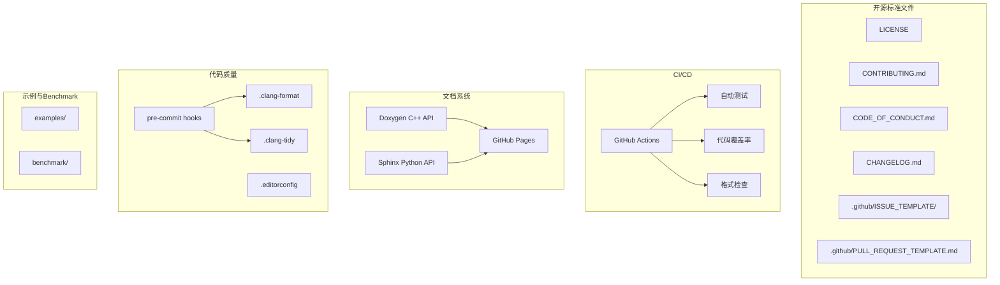

# Design Document: 项目质量完善

## Overview

本设计文档描述如何将 HPC-AI-Optimization-Lab 项目提升到优秀开源项目的标准。主要包括：开源标准文件、CI/CD 自动化、API 文档生成、Python 绑定完善、Benchmark 增强、示例代码和代码质量工具配置。

## Architecture



## Components and Interfaces

### 1. 开源标准文件

#### 1.1 LICENSE (MIT)
```
MIT License

Copyright (c) 2024 HPC-AI-Optimization-Lab

Permission is hereby granted, free of charge, to any person obtaining a copy
of this software and associated documentation files (the "Software"), to deal
in the Software without restriction, including without limitation the rights
to use, copy, modify, merge, publish, distribute, sublicense, and/or sell
copies of the Software, and to permit persons to whom the Software is
furnished to do so, subject to the following conditions:
...
```

#### 1.2 CONTRIBUTING.md 结构
- 如何报告 Bug
- 如何提交功能请求
- 开发环境设置
- 代码风格指南
- 提交 PR 流程
- 测试要求

#### 1.3 GitHub Templates
- Bug Report Template
- Feature Request Template
- Pull Request Template

### 2. CI/CD 配置

#### 2.1 GitHub Actions Workflow
```yaml
# .github/workflows/ci.yml
name: CI

on:
  push:
    branches: [main]
  pull_request:
    branches: [main]

jobs:
  build-and-test:
    runs-on: ubuntu-latest
    container:
      image: nvidia/cuda:12.4.1-devel-ubuntu22.04
    
    steps:
      - uses: actions/checkout@v4
      
      - name: Install dependencies
        run: |
          apt-get update
          apt-get install -y cmake ninja-build python3-pip
          pip3 install pytest torch numpy
      
      - name: Configure
        run: cmake -B build -G Ninja -DCMAKE_BUILD_TYPE=Release
      
      - name: Build
        run: cmake --build build
      
      - name: Test
        run: ctest --test-dir build --output-on-failure
```

#### 2.2 代码覆盖率配置
```yaml
# 使用 gcov + codecov
- name: Generate coverage
  run: |
    cmake -B build -DCMAKE_BUILD_TYPE=Debug -DCOVERAGE=ON
    cmake --build build
    ctest --test-dir build
    gcov -o build src/**/*.cu
    
- name: Upload coverage
  uses: codecov/codecov-action@v3
```

### 3. 文档系统

#### 3.1 Doxygen 配置
```
# Doxyfile
PROJECT_NAME           = "HPC-AI-Optimization-Lab"
OUTPUT_DIRECTORY       = docs/api
GENERATE_HTML          = YES
GENERATE_LATEX         = NO
INPUT                  = src
FILE_PATTERNS          = *.cuh *.cu *.hpp *.cpp
RECURSIVE              = YES
EXTRACT_ALL            = YES
USE_MDFILE_AS_MAINPAGE = README.md
```

#### 3.2 Sphinx 配置
```python
# docs/conf.py
project = 'HPC-AI-Optimization-Lab'
extensions = [
    'sphinx.ext.autodoc',
    'sphinx.ext.napoleon',
    'sphinx_rtd_theme',
]
html_theme = 'sphinx_rtd_theme'
```

### 4. Python 绑定完善

#### 4.1 完整绑定结构
```cpp
// python/bindings/bindings.cpp
#include <nanobind/nanobind.h>
#include <nanobind/tensor.h>

namespace nb = nanobind;

// Elementwise 模块
void bind_elementwise(nb::module_& m);
// Reduction 模块
void bind_reduction(nb::module_& m);
// GEMM 模块
void bind_gemm(nb::module_& m);
// Attention 模块
void bind_attention(nb::module_& m);

NB_MODULE(hpc_kernels, m) {
    m.doc() = "HPC-AI-Optimization-Lab CUDA Kernels";
    
    auto elementwise = m.def_submodule("elementwise");
    bind_elementwise(elementwise);
    
    auto reduction = m.def_submodule("reduction");
    bind_reduction(reduction);
    
    auto gemm = m.def_submodule("gemm");
    bind_gemm(gemm);
    
    auto attention = m.def_submodule("attention");
    bind_attention(attention);
}
```

#### 4.2 类型提示 Stub 文件
```python
# python/hpc_kernels/__init__.pyi
from typing import overload
import torch

class elementwise:
    @staticmethod
    def relu(input: torch.Tensor, output: torch.Tensor) -> None: ...
    
    @staticmethod
    def sigmoid(input: torch.Tensor, output: torch.Tensor) -> None: ...
```

### 5. 代码质量工具

#### 5.1 .clang-format
```yaml
BasedOnStyle: Google
IndentWidth: 4
ColumnLimit: 100
AllowShortFunctionsOnASingleLine: Empty
BreakBeforeBraces: Attach
```

#### 5.2 pre-commit 配置
```yaml
# .pre-commit-config.yaml
repos:
  - repo: https://github.com/pre-commit/pre-commit-hooks
    rev: v4.5.0
    hooks:
      - id: trailing-whitespace
      - id: end-of-file-fixer
      
  - repo: https://github.com/pre-commit/mirrors-clang-format
    rev: v17.0.6
    hooks:
      - id: clang-format
        types_or: [c++, cuda]
```

## Data Models

### Benchmark 结果格式
```python
@dataclass
class BenchmarkResult:
    kernel_name: str
    opt_level: str
    elapsed_ms: float
    bandwidth_gbps: float  # For memory-bound
    tflops: float          # For compute-bound
    efficiency: float      # vs theoretical peak
    vs_pytorch: float      # Speedup vs PyTorch
    vs_cublas: float       # Speedup vs cuBLAS (for GEMM)
```

## Correctness Properties

*A property is a characteristic or behavior that should hold true across all valid executions of a system—essentially, a formal statement about what the system should do. Properties serve as the bridge between human-readable specifications and machine-verifiable correctness guarantees.*

基于 prework 分析，本项目的改进主要涉及配置文件和文档，大多数验证是文件存在性检查（example 类型）。唯一需要属性测试的是 Python 绑定的错误处理：

### Property 1: Python Binding Error Messages
*For any* invalid input to Python bindings (wrong dtype, wrong device, wrong shape), the binding SHALL raise a descriptive Python exception rather than crashing or returning silently.

**Validates: Requirements 5.5**

## Error Handling

### Python 绑定错误处理
```cpp
void bind_relu(nb::module_& m) {
    m.def("relu", [](nb::tensor<float, nb::device::cuda> input,
                     nb::tensor<float, nb::device::cuda> output) {
        if (input.size() != output.size()) {
            throw std::invalid_argument(
                "Input and output tensors must have the same size");
        }
        // ... kernel call
    });
}
```

## Testing Strategy

### 验证方法

由于本项目改进主要涉及配置文件和文档，测试策略以验证文件存在性和配置正确性为主：

1. **文件存在性测试**: 检查所有必需文件是否存在
2. **CI 配置验证**: 通过 GitHub Actions 运行验证
3. **文档生成验证**: 运行 Doxygen/Sphinx 检查输出
4. **Python 绑定测试**: 导入模块并调用函数

### 测试脚本示例
```python
# tests/test_project_structure.py
import os
import pytest

def test_license_exists():
    assert os.path.exists("LICENSE")

def test_contributing_exists():
    assert os.path.exists("CONTRIBUTING.md")

def test_github_templates_exist():
    assert os.path.exists(".github/ISSUE_TEMPLATE")
    assert os.path.exists(".github/PULL_REQUEST_TEMPLATE.md")

def test_clang_format_exists():
    assert os.path.exists(".clang-format")
```

